# Laptop Sales Website

This repository contains a PHP-based e-commerce website for selling laptops and computer components.

## Project Structure

- **Admin Panel**: Management interface for administrators
- **Customer Portal**: Front-end shopping experience for customers
- **Database**: MySQL-based product and user management

## Admin Features

The administrative panel provides tools for managing products, orders, accounts, and viewing statistics.

### Admin Screenshots

| Feature              | Screenshot                                                         |
| -------------------- | ------------------------------------------------------------------ |
| Account Management   | 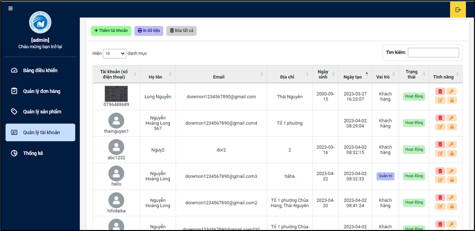 |
| Order Management     | 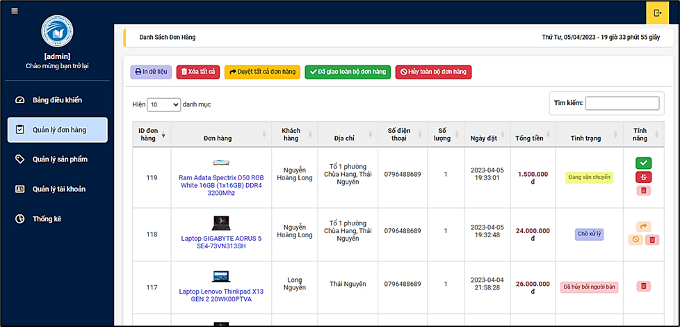     |
| Product Management   | 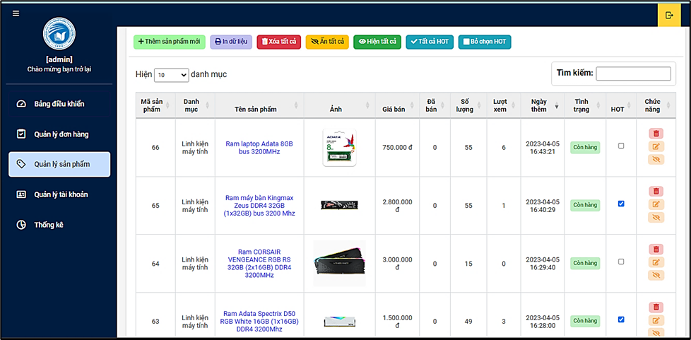 |
| Statistics Dashboard | 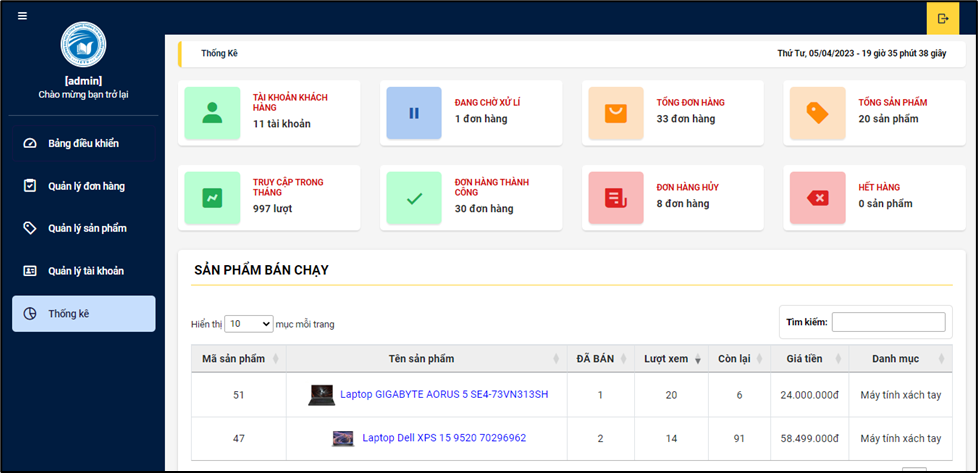                |

## Customer Features

Customers can browse products, view details, add items to cart, place orders, and manage their accounts.

### Customer Interface Screenshots

| Feature            | Screenshot                                          |
| ------------------ | --------------------------------------------------- |
| Homepage           | 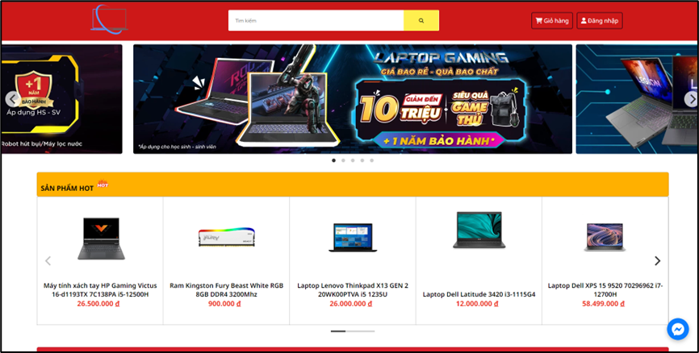               |
| Product Search     | 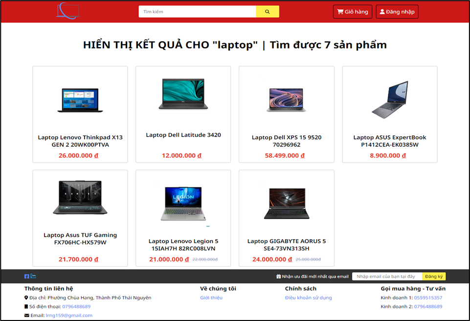               |
| Product Categories | 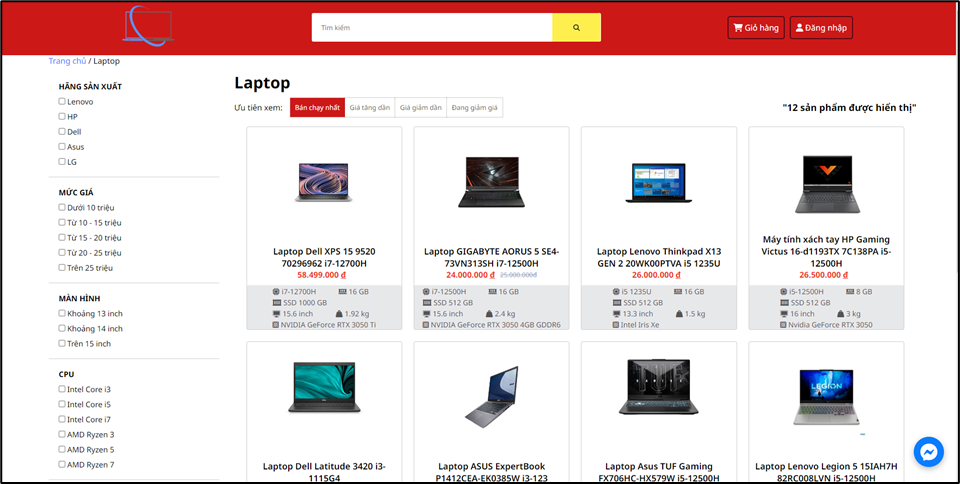    |
| Product Details    | 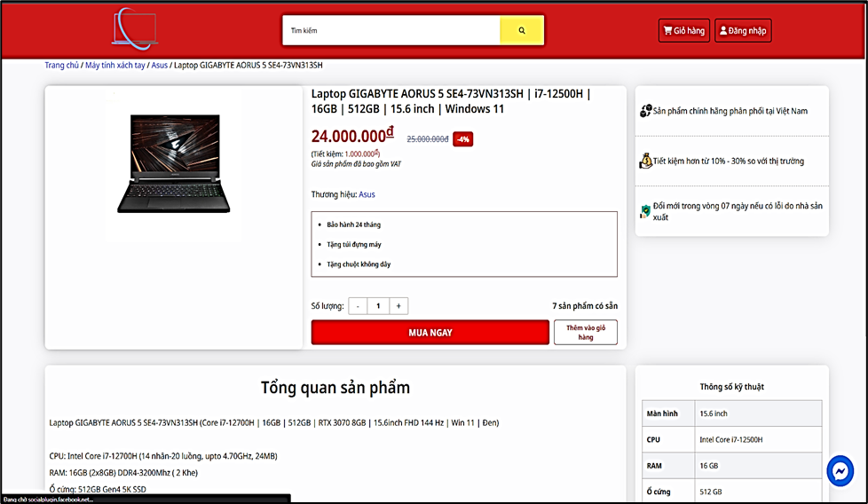 |
| Shopping Cart      | 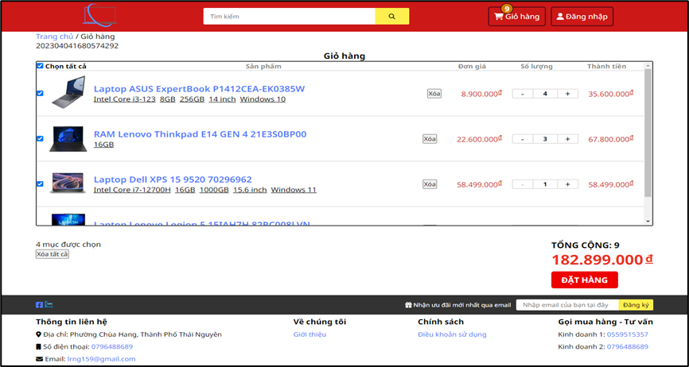          |
| Order Management   | 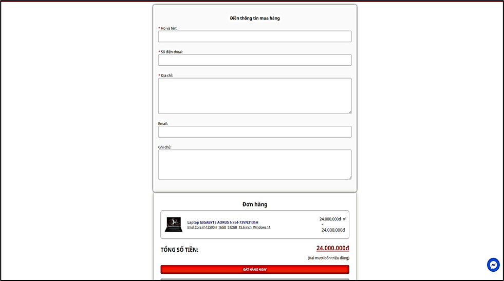                |
| Sign In            | 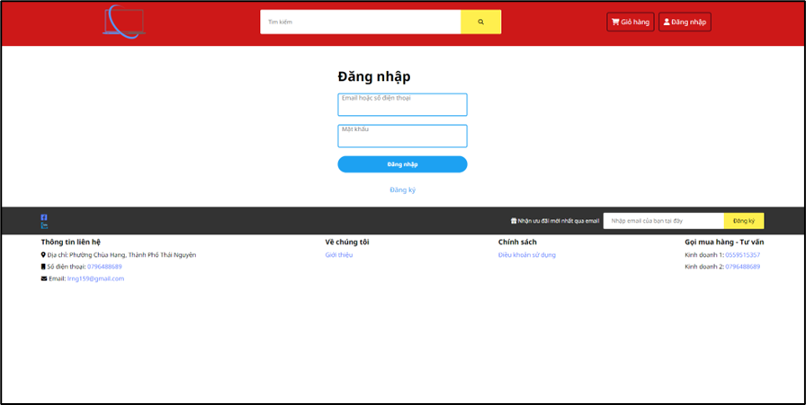              |
| Sign Up            | 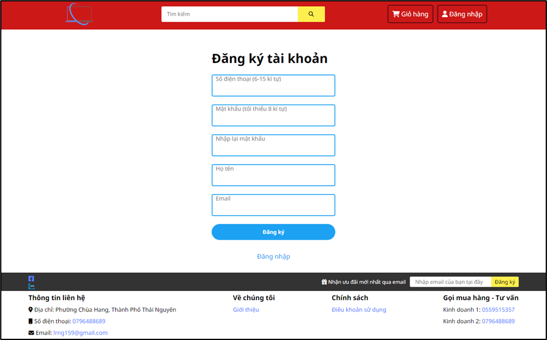              |

## Technologies Used

- PHP (MVC Architecture)
- MySQL Database
- HTML/CSS/JavaScript
- jQuery
- DataTables
- SweetAlert
- PHPMailer

## Installation

1. Import `laptoptn_laptop.sql` into your MySQL database
2. Configure database connection in `Models/DB.php`
3. Place the project files in your web server directory
4. Access the website through your local server
